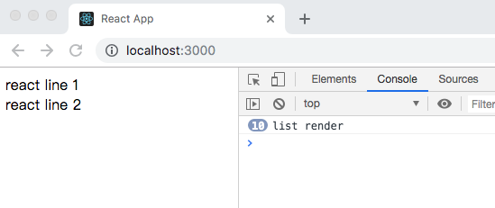

# PureComponent

React15.3中新加了一个PureComponent类，取代之前的PureRenderMixin , PureComponent可以进行React性能优化，减少不必要的render渲染次数，使用时只要把继承类从Component换成PureComponent。

PureComponent的原理是继承了Component类，自动加载shouldComponentUpdate函数，当组件更新时，shouldComponentUpdate对props和state进行了一层浅比较，如果组件的props和state都没有发生改变，render方法就不会触发，省去Virtual DOM的生成和对比过程，达到提升性能的目的。

下面从PureComponent的使用和源码来彻底了解它.

## shouldComponentUpdate优化性能

在PureComponent之前，我们经常看到优化react性能最常见的手段之一就是在react的生命周期函数shouldComponentUpdate里判断props或state的数据是否发生变化，通过返回ture(更新)和false(不更新)来阻止不必要的render.

首先来看看react产生不必要渲染的一个场景：

用create-react-app来初始化react的运行环境，然后在App.js文件里创建一个定时任务，每隔一秒更新数据：

```js
import React, { Component } from 'react'
import ShouldComponentUpdateList from './ShouldComponentUpdateList'

// 容器组件
export default class App extends Component {
    state = {
        data: []
    }
    componentDidMount() {
        // 定时任务，每隔一秒更新数据
        setInterval(() => {
            this.setState({
                data: [
                    { title: 'react line 1' }, 
                    { title: 'react line 2' }, 
                ]
            })
        }, 1000)
    }
    render() {
        return(
            <div>
                {
                    this.state.data.map((item, index) => (
                        <ShouldComponentUpdateList key={index} list={item} />
                    ))
                }
            </div>
        )
    }
}
```

ShouldComponentUpdateList组件内容为：

```js
export default class List extends Component {
    render() {
        console.log('list render')
        return(
            <div>{this.props.list.title}</div>
        )
    }
}
```

命令行运行npm start，浏览器查看输出：



发现控制台每隔一秒都会输出`list render`，明明数据没有发生变化，但是react还是发生渲染，造成了不必要的渲染浪费。

只需要在shuoldComponentUpdate里加上判断，再次查看输出结果，定时任务的数据没有发生改变，不会再渲染render函数：

```js
export default class List extends Component {
    // 在shuoldComponentUpdate里判断props传递的数据没有发生变化，则不需要render
    shouldComponentUpdate(nextProps) {
        // 返回值为true则render，为false则不render
        if(nextProps.list.title === this.props.list.title) {
            return false
        }
        return true
    }
    render() {
        console.log('list render')
        return(
            <div>{this.props.list.title}</div>
        )
    }
}
```

## PureComponent使用

除了使用shouldComponentUpdate来判断是否需要更新组件，还可以用PureComponent, PureComponent实际上自动加载shouldComponentUpdate函数，当组件更新时，shouldComponentUpdate对props和state进行了一层浅比较.

新建PureComponentList组件，用PureComponent代替Component：

```js
import React, { PureComponent } from 'react'
export default class List extends PureComponent {
    render() {
        console.log('list render')
        return(
            <div>{this.props.list.title}</div>
        )
    }
}
```

在App组件中传入：

```js
this.state.data.map((item, index) => (
    <PureComponentList key={index} list={item}/>
))
```

然后查看浏览器输出结果，惊奇地发生，PureComponent并没有阻止不必要render，这是为什么呢？因为前面我们说到PureComponent的shouldComponentUpdate只对props和state进行浅比较，也就是`this.props = { list: { title: 'react line1' } }`，`nextProps = { list: { title: 'react line1' } }`，作浅比较的话this.props当然不等于next.props.

为了更清晰地找到原因，我们先来看看PureComponent的源码.

## PureComponent源码

首先找到PureComponent这个函数，在构造函数和原型上分别继承了Component的属性和方法：

```js
export default function PureComponent(props, context) {
    Component.call(this, props, context)
}

PureComponent.prototype = Object.create(Component.prototype)
PureComponent.prototype.constructor = PureComponent
PureComponent.prototype.shouldComponentUpdate = shallowCompare

function shallowCompare(nexProps, nextState) {
    return !shallowEqual(this.props, nextProps) || !shollowEqual(this.state, nextState)
}
```
接着PureComponent在生命周期函数里面写了shallowCompare方法，shallowCompare里面通过shallowEqual的返回值来返回ture还是false.

接着来看看shallowEqual函数，[源码地址](https://github.com/facebook/fbjs/blob/master/packages/fbjs/src/core/shallowEqual.js)：

```js
export default function shallEqual(objA, objB) {
    // 从后面代码可以看出，对于两个对象的比较为这里的代码
    if (objA === objB) {
        return true;
    }

    if (typeof objA !== 'object' || objA === null ||
        typeof objB !== 'object' || objB === null) {
        return false;
    }

    const keysA = Object.keys(objA);
    const keysB = Object.keys(objB);

    if (keysA.length !== keysB.length) {
        return false;
    }

    // Test for A's keys different from B.
    for (let i = 0; i < keysA.length; i++) {
        if (!objB.hasOwnProperty(keysA[i]) || objA[keysA[i]] !== objB[keysA[i]]) {
            return false;
        }
    }

    return true;
}
```

从上面浅比较的源码shallowEqual函数可以看出，shallEqual对于对象的比较仅仅通过`if (objA === objB) { return true; }`来判断，而`let a = { list: { title: 'react line1' } }`，`let b = { list: { title: 'react line1' } }`, a === b值为false，所以这就很好的解释了上面PureComponent并没有阻止不必要render的原因。

所以我们来改进代码，使得PureComponent的props如果传入对象情况下应该如何起效：

在App.js里面修改PureComponentList组件传入item.title而不是item对象，浏览器只输出两次log：

```js
this.state.data.map((item, index) => (
    // <PureComponentList key={index} list={item}/>
    <PureComponentList key={index} title={item.title}/>
))
```

通过解构item对象，传入item.title，这样就可以进行浅比较，来达到优化不必要渲染的目的.

## PureComponent原则

由上面探究PureComponent源码我们知道，PureComponent的组件在props或者state的属性值是对象的情况下，并不能阻止不必要的渲染，是因为自动加载的shouldComponentUpdate里面做的只是浅比较，所以想要用PureComponent的特性，应该遵守原则：

* 确保数据类型是值类型
* 如果是引用类型，不应当有深层次的数据变化(解构).

## React.memo

在使用PureComponent的时候，只能把react组件写成是class的形式，不能使用函数的形式；react v16.6.0之后，可以使用React.memo来实现函数式的组件，也有了PureComponent的功能。

List组件的PureComponent:

```js
const ListComponent = React.momo(() => (
    <div>{this.props.data || 'loading'}</div>
))
```

**注：上面涉及到的所有:point_right:[源代码](./src)**