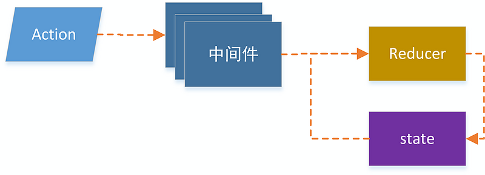
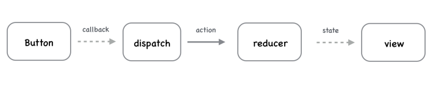
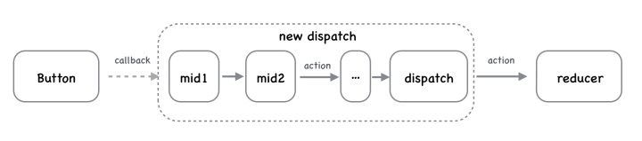

# redux中间件

利用redux中间件机制，一个action对象在通过store.dispatch派发，调用reducer函数前，可以执行其他的业务逻辑处理，这种处理就是redux中间件，如下图所示：



从上图可以看出，在一个redux架构中可以用多个中间件，一个中间件是一个独立的函数，可以组合使用，比如可以使用常见的日志记录中间件redux-logger，实现异步任务中间件redux-thunk.

## 为什么dispatch需要middleware



上图表达的是 redux 中一个简单的同步数据流动的场景，点击 button 后，在回调中 dispatch 一个 action，reducer 收到 action 后，更新 state 并通知 view 重新渲染。单向数据流，看着没什么问题。但是，如果需要打印每一个 action 信息用来调试，就得去改 dispatch 或者 reducer 代码，使其具有打印日志的功能；又比如点击 button 后，需要先去服务器请求数据，只有等拿到数据后，才能重新渲染 view，此时我们又希望 dispatch 或者 reducer 拥有异步请求的功能；再比如需要异步请求完数据后，打印一条日志，再请求数据，再打印日志，再渲染...



上面这张图展示了应用 middleware 后 redux 处理事件的逻辑，每一个 middleware 处理一个相对独立的业务需求，通过串联不同的 middleware，实现变化多样的的功能。

## 常用redux中间件使用

redux 提供了 applyMiddleware 这个 api 来加载 middleware

### redux-logger

日志中间件，记录redux的日志.

```bash
npm install redux-logger --save
```

使用：

```js
import { createStore, applyMiddleware } from 'redux'
import logger from 'redux-logger'

const store = createStore(
  reducer,
  applyMiddleware(logger)
)
export default store
```

在创建store对象的时候，可以传入第二个参数applyMiddleware(middleware)，这样每一次更新state，会在控制台打印redux更新日志.

### redux-thunk

redux中所有的action都是同步的，但是如果想要在action里异步请求完数据后，再dispatch到reducer，需要实现一个异步action对象，redux-thunk中间件可以支持异步action.

```bash
npm install redux-thunk --save
```

使用：(其中redux-thunk需要在redux-logger之前，因为如果有异步action需要redux-logger在异步之后输出)

```js
...
import thunk from 'redux-thunk'

const store = createStore(
    reducer,
    applyMiddleware(thunk, logger)
)
```
action里面有异步代码的情况，不用redux-thunk之前redux只支持dispatch一个对象，有了redux-thunk之后，可以处理返回函数，应用了redux-thunk后可以传入(dispatch, getState)两个参数，在返回函数里面就可以写上异步代码了：

action.js:

```js
// redux-thunk之前
export function add(num) {
    return {
        type: 'ADD',
        payload: num
    }
}
// redux-thunk之后，可以return funciton(dispatch)，然后就可以写异步代码，等待异步执行后得到结果再dispatch，不必返回一个对象了
export function asyncAdd(num) {
    return dispatch => {
        setTimeout(() => {
            dispatch({
                type: 'ADD',
                payload: num
            })
        }, 1000)
    };
}
```

参考链接：

[redux middleware 详解](https://zhuanlan.zhihu.com/p/20597452#!)

[浅谈Redux中间件的实践](https://www.jb51.net/article/144558.htm)