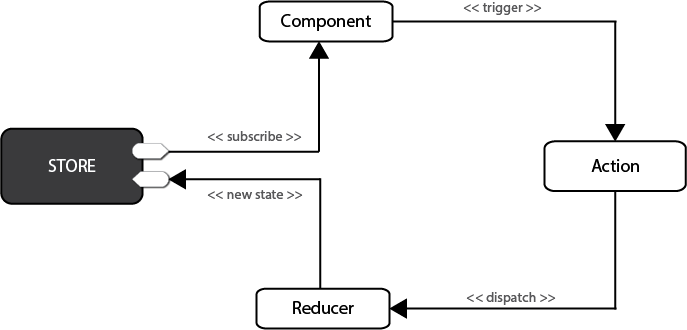
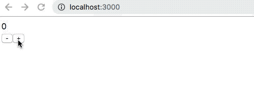

# redux

Redux是一个流行的JavaScript框架，为应用程序提供一个可预测的状态容器，提供数据状态管理。Redux基于简化版本的Flux框架，Flux是Facebook开发的一个框架。在标准的MVC框架中，数据可以在UI组件和存储之间双向流动，而Redux严格限制了数据只能在一个方向上流动。 见下图：



安装：

```bash
npm install redux --save
```

redux中核心概念为Action/Reducer/Store:

* Store: 状态载体，访问状态、提交状态更新、监听状态变更
* Reducer：状态更新执行者，纯函数
* Action：存放状态的对象，即状态的载体

结合上面的流程图来看看redux的基本使用，下面是一个计数的例子：

action.js:

```js
export function add(num) {
    return {
        type: 'ADD',
        payload: num
    }
}
export function minus(num) {
    return {
        type: 'MINUS',
        payload: num
    }
}
```

reducer.js:

```js
export default function couterReducer(state = {
    total: 0
}, action) {
    switch (action.type) {
        case 'ADD':
            return {
                total: state.total + action.payload
            }
        case 'MINUS':
            return {
                total: state.total - action.payload
            }
        default:
            return state
    }
}
```

store.js:

```js
import { createStore } from 'redux'
import couterReducer from './reducer'

const store = createStore(couterReducer)
export default store
```

ReduxTest.js:

```js
import React, { Component } from 'react'
import store from './store';
import { add, minus } from './action'

export default class ReduxTest extends Component {
    render() {
        return (
            <div>
                {store.getState().total}
                <div>
                    <button onClick={() => store.dispatch(minus(2))}>-</button>
                    <button onClick={() => store.dispatch(add(2))}>+</button>
                </div>
            </div>
        )
    }
}
```

入口文件index.js:

```js
import React from 'react';
import ReactDOM from 'react-dom';
import ReduxTest from './ReduxTest';
import store from './store';

const render = () => {
    ReactDOM.render(<ReduxTest />, document.getElementById('root'));
}
render()

store.subscribe(render)
```
效果图如下：



上面是一个完整的redux例子，实现了计数的功能，整个redux的流程是ReduxTest Component => dispatch action => reducer接收action处理state => 更新store state => ReduxTest Component里store.getState()得到state。

但是需要用store.subscribe来订阅state的变化，然后重新渲染render，组件中取数据也需要通过store.getState()，这样很麻烦，下面用[react-redux连接react组件和redux仓库](../react-redux)来更优雅地使用redux.


