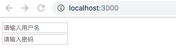

# 从react高阶组件看ant-design的Form表单源码实现

ant-design的Form表单组件其实是一个高阶组件，在高阶组件里将一些表单相关的信息处理后，其他组件用了这个高阶组件，就有了Form表单的功能。

## ant-design的Form表单组件的设计

下面我们来看看Form组件的使用：

```js
import { Form, Icon, Input } from 'antd';

class FormComponent extends React.Component {
  handleSubmit = (e) => {
    this.props.form.validateFields((err, values) => {
      if (!err) {
        console.log('Received values of form: ', values);
      }
    });
  }
  render() {
    const { getFieldDecorator } = this.props.form;
    return (
      <Form onSubmit={this.handleSubmit}>
        <Form.Item>
          {getFieldDecorator('userName', {
            rules: [{ required: true, message: 'Please input your username' }],
          })(
            <Input prefix={<Icon type="user" />} placeholder="Username" />
          )}
        </Form.Item>
        <Button type="primary" htmlType="submit">submit</Button>
      </Form>
    );
  }
}

const WrappedFormComponent = Form.create()(FormComponent);
```
上面FormComponent组件经过Form.create()高阶组件包装后，在props里面就有了form.getFieldDecorator方法（const { getFieldDecorator } = this.props.form），getFieldDecorator方法传入表单控件配置和Input组件，当Input输入框输入数据的时候会根据传入的表单控件配置进行验证，并且当提交的时候，props的form.validateFields里面可以得到验证错误信息和表单的数据。

## Form.create()和getFieldDecorator源码实现

从上面ant-design的Form组件的使用中可以看出，Form.create()是一个高阶组件，这个高阶组件提供了getFieldDecorator方法来返回传入的表单控件元素。

所以我们来简单实现上面两点要求：

新建Form.js，先来**实现Form.create()**：

```js
// Form.create高阶组件
function create(FormComponent) {
}
export const Form = {
  create,
}
```
这样就可以直接使用Form.create(Component)的形式调用高阶组件。

然后实现在被装饰组件中使用this.props.form.getFieldDecorator，getFieldDecorator方法其实首先是在Form.create高阶组件里面实现的，是用React.cloneElement克隆传入的表单控件元素并返回一个新的React元素，然后被装饰的组件，想使用高阶组件内部的getFieldDecorator方法，只需要在高阶组件内部在新返回的组件加上getFieldDecorator属性传递，被装饰的组件用props接收即可。为了进一步达到ant-design的this.props.form.getFieldDecorator的方式，把getFieldDecorator当做form的属性，将form传递到被装饰的组件中。

**getFieldDecorator的实现：**

```js
function create(FormComponent) {
  return class extends Component {
    constructor(props) {
      super(props);
    }
    getFieldDecorator = (field, option) => {
      return (Comp) => {
        return(
          <div>
            {/* React.cloneElement克隆并返回一个新的React元素，第一个元素为克隆元素，第二个参数为克隆元素添加新的props */}
            {
              React.cloneElement(Comp, {
                name: field, // 控件名
                value: this.state.values[field] || '', // 控件value值
                onChange: this.handleChange, // 将onChange集中在高阶组件里处理
              })
            }
          </div>
        )
      }
    }

    render() {
      const form = {
        getFieldDecorator: (field, option) => {
          return (Comp) => {
            return this.getFieldDecorator(field, option)(Comp)
          }
        }
      }
      // 将form传递到被装饰的组件中，被装饰的组件可以通过props获取
      return <FormComponent {...this.props} form={form}/>
    }
  }
}
```

新建FormSample.js测试Form.create高阶组件的getFieldDecorator功能：

```js
import React, { Component } from 'react'
import { Form } from './Form'

class FormSample extends Component {
  render() {
    const { getFieldDecorator } = this.props.form;
    return (
      <div>
        {
          getFieldDecorator('username', {
            rules: [{ require: true, message: '请填写用户名' }]
          })(<input type="text" placeholder="请输入用户名" />)
        }
        {
          getFieldDecorator('password', {
            rules: [{ require: true, message: '请填写密码' }]
          })(<input type="password" placeholder="请输入密码" />)
        }
      </div>
    )
  }
}
const WrappedFormSample = Form.create(FormSample)
export default WrappedFormSample

```
运行npm start，查看浏览器发现成功生成两个表单控件，说明getFieldDecorator方法成功，结果如下图所示：



validateFields，FormItem等更多的实现请看[源代码](./src/Form.js)

