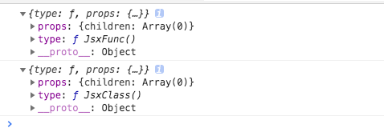

# react源码之组件和生命周期实现

在上一篇文章[react源码之JSX与虚拟dom原理解析](../virtual-dom/README.md)，我们实现了基础的JSX渲染功能，但是React的意义在于组件化。在这篇文章中，我们就要实现React的组件功能。

## React.Component

react中的组件分为函数组件和class组件，函数组件可以看做是class组件的一种简单形式。所以我们首先来实现以下Component这个类。

在react中，class组件需要继承Component：

```js
import React, { Component } from 'react';
```
所以在src/react.js里来初步实现这个Component类，这里只是简单初始化state和props，为后面组件的渲染做准备。

```js
export class Component {
    constructor( props = {} ) {
        this.props = props;
        this.state = {};
    }
    setState() {
        // 后面实现
    }
}

const React = {
    ...,
    Component,
};
```

测试class组件和函数组件，看一下它们的虚拟dom：

```js
import React, { Component } from './react';
// import ReactDOM from 'react-dom';

function JsxFunc(){
    return (
        <div id="jsx">
            <span>jsx</span>
        </div>
    )
}

class JsxClass extends Component {
    render() {
        return (
            <div id="jsx">
                <span>jsx</span>
            </div>
        )
    }
}
console.log(<JsxFunc/>)
console.log(<JsxClass/>)

// ReactDOM.render(<JsxFunc/>, document.getElementById('root'));
```
分别输出函数组件`<JsxFunc/>`和class组件`<JsxClass/>`，查看它们的虚拟dom结构如下：



对比上一篇文章[react源码之JSX与虚拟dom原理解析](../virtual-dom/README.md)中的原生dom的虚拟dom结构，可以发现type不再是标签，而是函数的形式。(注：为了验证组件的虚拟dom结构的正确性，可以直接`import React, { Component } from 'react';`而不是引入自己写的react文件，来验证组件的虚拟dom结构也还是如此)

实际上，对于组件，createElement得到的参数略有不同：
如果JSX片段中的某个元素是组件，那么createElement的第一个参数将会是一个方法，而不是字符串。

> 区分组件和原生DOM的工作，是babel帮我们做的

我们不需要对createElement做修改，只需要知道如果渲染的是组件，type的值将是一个函数，所以需要判断type来渲染组件的虚拟dom。

## render

上一篇文章中实现的render方法只支持渲染原生DOM元素，我们需要修改ReactDOM.render方法，让其支持渲染组件的虚拟dom。

加上虚拟dom树vnode的type为function的判断：


参考链接：

[从零开始实现一个React（二）：组件和生命周期](https://github.com/hujiulong/blog/issues/5)