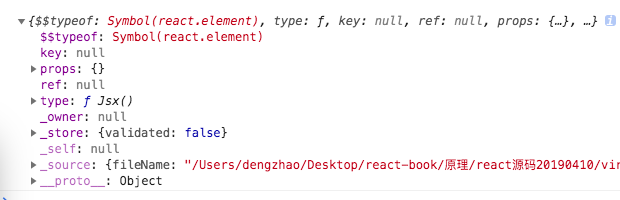
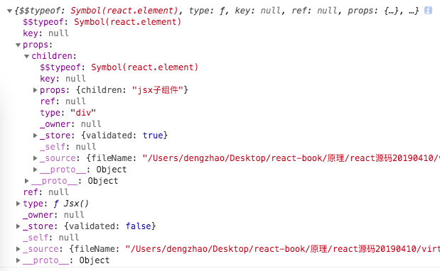
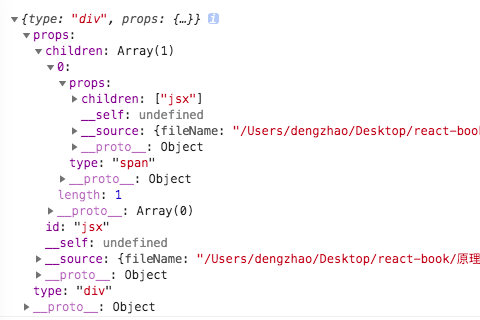
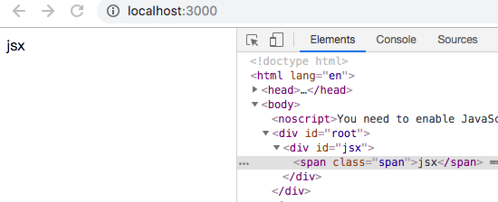

# react源码之JSX与虚拟dom原理解析

在分析JSX和virtual-dom之前，我们可以看看[官方react源码](https://github.com/facebook/react/blob/master/packages/react/src/React.js)，在这个链接里就是react的源码入口，主要暴露了react的一些api，比如react一些核心api createElement，Component，PureComponent等都暴露在了React对象里面，而react-dom主要负责render。

## JSX原理

* jsx是什么？jsx是对js语法的扩展，在js里能够写html。

* 为什么要用jsx？是因为jsx编译快，简单快速；在编译阶段就可以发现错误，所以安全。

* jsx原理：

jsx本质上是将jsx语法的代码转换成React.createElement，为react内部创建虚拟dom提供条件。

简单来说，**jsx的原理是webpack和babel-loader编译jsx为React.createElement(type, props, ...children)的形式。**

在[Babel](https://babeljs.io/repl/)官网上实验一下将jsx编译成React.createElement：


```js
import React, { Component } from 'react';
import ReactDOM from 'react-dom';

class Jsx extends Component {
    render() {
        return(
            <div id="jsx">
                <span>jsx</span>
            </div>
        )
    }
}
ReactDOM.render(<Jsx />, document.getElementById('root'));
```

Babel编译后：(不要勾选编译es2015)

```js
import React, { Component } from 'react';
import ReactDOM from 'react-dom';

class Jsx extends Component {
    render() {
        return React.createElement(
            "div", 
            { id: "jsx" }, 
            React.createElement("span", null, "jsx")
        );
    }
}

ReactDOM.render(React.createElement(Jsx, null), document.getElementById('root'));
```

可以看到jsx部分都会被编译成调用React.createElement的形式，所以React.createElement(type, props, ...children)中参数依次为节点类型，节点属性(或props)，子节点(子节点也会递归调用React.createElement)。

## 虚拟dom

### 虚拟dom是什么？

webpack和babel-loader编译时，替换jsx成React.createElement形式后，**React.createElement执行得到一个js对象树，这个js对象树能完整描述dom结构，称之为虚拟dom(virtual-dom)。**

下面在react中输出看看这个虚拟dom是什么样子：

```js
class Jsx extends Component {
    render() {
        return (
            <div id="jsx">
                <span>jsx</span>
            </div>
        )
    }
}
console.log(<Jsx />)
```

`<Jsx />`组件是什么呢？用console.log打印出来：



发现`<Jsx />`是js对象而不是真实的dom，这个对象包含了type，props这些我们在前面讲到的babel转化jsx为React.createElement里面的两个参数，注意此时props是空对象。接下来，我们添加子节点打印`<Jsx><div>jsx子组件</div></Jsx>`，看看控制台会输出什么：



props发生了变化，由于`<Jsx />`组件中加了子组件`<div>jsx子组件</div>`，所以在描述`<Jsx />`的对象props中增加了children。同理，如果我们进行多层的组件嵌套，其实就是在父对象的props中增加children字段及对应的描述值，也就是js对象的递归嵌套。

## React.createElement生成虚拟dom

**虚拟dom其实就是描述真实dom结构的js对象**，在react中通过React.createElement生成。


下面来写一个自己的react.js和react.dom.js：

src/react.js:

```js
function createElement(type, props, ...children) {
    props.children = children;
    return { type, props };
}

const React = {
    createElement,
};
export default React;
```
在jsx编译成createElement的形式时，在react内部需要有一个方法createElement来接收babel编译好的type, props, children, 这里作一个将children放到props里面的简单处理后返回这些参数的操作，这样就生成了最简单的虚拟dom。

src/index.js测试：

```js
import React from './react';
// import ReactDOM from 'react-dom';

const Jsx = (
    <div id="jsx">
        <span>jsx</span>
    </div>
)
console.log(Jsx)

// ReactDOM.render(Jsx, document.getElementById('root'));
```

上面的测试代码中，为了更好地显示虚拟dom的结构，`Jsx`是原生dom方式，没有写成函数组件或者class组件，输出`Jsx`，发现虚拟dom的结构如下，达到预期效果：



## ReactDOM.render生成真实dom

react-dom.js中的render方法负责将虚拟dom转化为真实dom显示在页面中

来看看ReactDOM.render的使用：

```js
ReactDOM.render(Jsx, document.getElementById('root'));
```

ReactDOM.render传入的第一个参数其实就是经过转换后的虚拟dom，第二个参数是挂载的dom节点

新建react-dom.js，实现render方法：

```js
function render(vnode, container) {
    // vnode为虚拟dom树
    const dom = initVnode(vnode);

    return container.appendChild( dom );   // 将最后的渲染结果dom添加到根节点
}

// 判断节点类型将虚拟dom转换为真实dom
function initVnode(vnode) {
    // vnode为文本节点
    if ( !vnode.type && typeof vnode === 'string' ) {
        return document.createTextNode( vnode );
    }
    // vnode为原生标签
    if ( typeof vnode.type === 'string' ) {
        return createEle(vnode);
    }
}

function createEle(vnode) {
    const { type, props } = vnode;
    const node = document.createElement( type );
    
    // 属性处理
    const { key, children, ...rest } = props;
    Object.keys( rest ).forEach( attr => {
        const value = rest[attr];
        setAttribute( node, attr, value );    // 设置属性
    } );

    // 递归渲染子节点
    props.children.forEach( child => {
        node.appendChild(initVnode(child))
    });    
    return node;
}
```
render将虚拟dom渲染成真实dom的逻辑，判断节点类型为标签调用document.createElement将vnode.type创建成元素，对元素进行属性的处理，最关键是递归遍历props.children子节点，将子节点appendChild，直到vnode的类型是文本节点，将最终的渲染结果添加到根节点上。

设置属性需要考虑一些特殊情况，我们单独将其拿出来作为一个方法setAttribute

```js
function setAttribute( dom, name, value ) {
    // 如果属性名是className，则改回class
    if ( name === 'className' ) name = 'class';

    // 如果属性名是onXXX，则是一个事件监听方法
    if ( /on\w+/.test( name ) ) {
        name = name.toLowerCase();
        dom[ name ] = value || '';
    // 如果属性名是style，则更新style对象
    } else if ( name === 'style' ) {
        if ( !value || typeof value === 'string' ) {
            dom.style.cssText = value || '';
        } else if ( value && typeof value === 'object' ) {
            for ( let name in value ) {
                // 可以通过style={ width: 20 }这种形式来设置样式，可以省略掉单位px
                dom.style[ name ] = typeof value[ name ] === 'number' ? value[ name ] + 'px' : value[ name ];
            }
        }
    // 普通属性则直接更新属性
    } else {
        if ( value ) {
            dom.setAttribute( name, value );
        } else {
            dom.removeAttribute( name );
        }
    }
}
```

这里其实还有个小问题：当多次调用render函数时，不会清除原来的内容。所以我们将其附加到ReactDOM对象上时，先清除一下挂载目标DOM的内容：

```js
const ReactDOM = {
    render: (vnode, container) => {
        container.innerHTML = '';
        return render( vnode, container );
    }
}
export default ReactDOM;
```
这样就实现了最基础的将虚拟dom转换为真实dom的功能。

## 渲染和更新

到这里我们已经实现了React最为基础的功能，可以用它来做一些事了。

```js
import React from './react';
import ReactDOM from './react-dom';

const Jsx = (
    <div id="jsx" >
        <span className="span">jsx</span>
    </div>
)

ReactDOM.render(Jsx, document.getElementById('root'));
```

结果如下图所示，可以看到dom结构都渲染出来了，并且class等属性成功处理：




参考链接：

[React源码解析(一):组件的实现与挂载](https://juejin.im/post/5983dfbcf265da3e2f7f32de)

[React源码分析 - 组件初次渲染](https://juejin.im/post/5a92e02d6fb9a0633d71f7f7)

[从零开始实现一个React（一）：JSX和虚拟DOM](https://github.com/hujiulong/blog/issues/4)